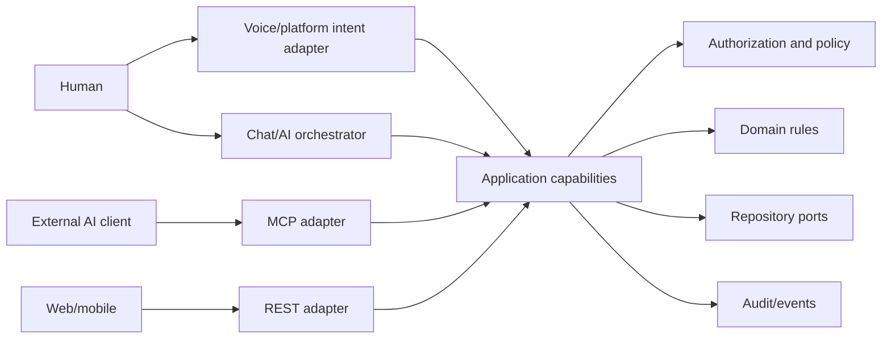

# MCP, AI, voice, and external integrations

## One backend, multiple adapters

MCP, REST, ChatGPT/Claude, Alexa, Siri/App Intents, Google Assistant, and local assistants are
protocol adapters. They do not own WhereHouse rules or query persistence directly.

AI interprets requests and chooses approved capabilities. It is not the source of truth and cannot
bypass authorization, validation, confirmation, or transactions. Deterministic parsing/direct UI
can serve core workflows when AI or the internet is unavailable.

## Proposed MCP shape

Initial read-only tools should prove identity and boundary design:

- `wherehouse.search_items`, `get_item`, `locate_item`
- `wherehouse.list_locations`, `get_location`, `get_location_contents`, `search_locations`
- `wherehouse.get_inventory_summary`

Later mutating tools may expose `add_item`, `update_item`, `move_item`, `remove_item`, and location
management. Spatial tools such as `get_spatial_map` and `find_available_space` wait for corresponding
application capabilities and data.

Resources may expose authorized snapshots through `wherehouse://inventory`,
`wherehouse://items/{id}`, `wherehouse://locations`, `wherehouse://locations/{id}`, and eventually
`wherehouse://spaces/{id}`. Resource templates resolve through query capabilities and apply the same
household boundaries as tools. Resource URIs are locators, not credentials.

An MCP tool maps one-to-one to an application capability where practical. Its schema can be tailored
for model use, while results retain stable entity IDs, explicit ambiguity, confidence/provenance, and
safe summaries. MCP differs from REST in discovery, model-oriented descriptions, resource access,
sessions, and elicitation; it does not differ in business semantics.

## Local and cloud operation

**Local MCP:** run beside the modular monolith on the Pi/desktop, use local application capabilities,
and bind to loopback by default. Stdio is appropriate for a same-machine client; authenticated
network transport is required for another device.

**Cloud/remote MCP:** terminate TLS, use explicit user authorization, bind credentials to household
and scopes, validate redirect/origin details, rate limit, revoke sessions, and audit access. Do not
expose a self-hosted household inventory to the internet automatically. A secure tunnel or owner-
configured gateway is a deployment choice, not a default.

## Identity, permissions, and confirmation

Extend the current principal into an actor context. Integration credentials need a client ID,
session ID, user/household identity, expiry/revocation, and scopes such as:

- `inventory:read`, `inventory:write`
- `locations:read`, `locations:write`
- `spatial:read`, `spatial:write`
- `admin`

Least privilege is enforced inside capabilities, not only in the MCP/REST router. Treat input,
resource URIs, model output, and client-provided identity as untrusted. Never infer a household from
an entity without also verifying actor access.

Reads usually execute directly. Adds/edits may require confirmation when ambiguity or material
impact exists. Moves and deletes require a preview containing exact targets and destinations;
destructive or bulk actions require explicit confirmation. A confirmation is bound to the actor,
client, normalized arguments, and expiry and is checked again at execution. Voice confirmations
repeat the important change. Idempotency keys prevent retries from duplicating writes.

Audit entries include actor, client/session, capability, target IDs, outcome, AI-assisted status,
confirmation evidence, and request correlation ID. Do not persist raw voice audio or prompts by
default.

## Assistant interaction paths

- “Where are my HDMI cables?” → interpret → `SearchItems` → disambiguate → `LocateItem` → speak a
  breadcrumb and offer an item card/deep link.
- “What’s in the camping bin?” → resolve QR/name → `GetLocationContents` → summarize canonical data.
- “Move the air mattress…” → resolve both entities → preview `MoveItem` → user confirms → execute and
  audit.
- “Where should I store this?” → optional AI/storage recommender reads candidates → presents reasons
  and confidence → a separate confirmed move capability applies the choice.
- “What is on the shelf above the workbench?” → use logical relationships today; use spatial anchors
  only when a valid mapped model exists.

Platform integrations may call MCP, REST, or an in-process adapter depending on platform constraints.
Deep links open authored or generative UI at a stable entity/action. The protocol choice must not
change capability semantics.

## Validation and session safety

- Use closed schemas, bounded strings/results, UUID/code formats, and no arbitrary query language.
- Return structured ambiguity instead of guessing among similarly named objects.
- Separate read and write tool exposure where clients support it.
- Pin MCP schema/tool versions and declare server capabilities.
- Rate limit enumeration and image/spatial access; redact sensitive logs.
- Reauthorize each call; session state is a convenience, never proof of permission.
- For external AI, minimize shared inventory fields and make provider use visible and optional.

## Implementation order

First extract/test application capabilities and actor context. Then add scopes/audit and one local,
read-only MCP vertical slice. Only after that add confirmed writes, remote hosting, assistant-specific
adapters, and generative UI responses. Do not create an MCP scaffold before those foundations have a
real consumer.
