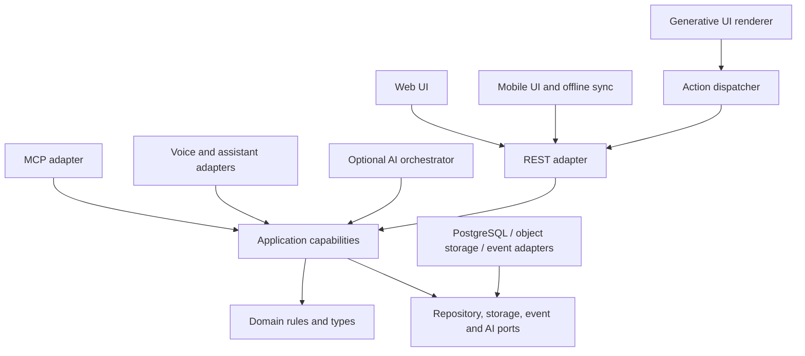

# Future architecture overview

## Product direction

WhereHouse is intended to become an intelligent interface for understanding, locating, organizing,
and interacting with a home's physical contents. Web and mobile inventory remain the foundation.
Natural-language assistants, MCP, controlled generative UI, QR-linked objects, optional spatial
models, 3D views, and AR guidance are additional interfaces over the same household model.

This is an evolutionary architecture. The system remains a modular monolith until operational
evidence justifies another deployment shape. See [what to build now](../product/build-now-vs-later.md).

## Repository assessment (August 2026)

| Area | Current state | Architectural implication |
| --- | --- | --- |
| Web | React features under `apps/web/src/features`; shared API client | Good presentation split; feature hooks still orchestrate screen-specific calls |
| Mobile | Expo screens, components, hooks, SQLite cache, queued item writes | Good platform boundary; sync semantics need reusable capability contracts |
| API | FastAPI modular monolith with versioned routes | Appropriate deployment shape; routes currently contain application behavior |
| Persistence | PostgreSQL, SQLAlchemy models, Alembic migrations | Stable UUIDs and additive migrations are a strong base |
| Shared contracts | Handwritten TypeScript types and resource clients in `packages/api-client` | Useful today; must prevent drift from Pydantic/OpenAPI as clients expand |
| Locations | Fixed Area and Zone prefix, arbitrary nested Container placements | Supports MVP and deep container nesting, but not one uniform arbitrary location tree |
| Identity | Stable UUIDs, compatibility codes, and first-class typed `PhysicalIdentifier` records | Strong medium-neutral base; lifecycle and physical validation need hardening |
| Auth | Household membership, household-scoped device credentials, and basic actor context | Strong base; persisted capability scopes and audit context wait for integration consumers |
| Events | In-process realtime invalidations published from routes and extracted item capabilities | Useful current consumer; not durable domain events or an audit record |

Infrastructure services cover image storage, codes and realtime. The application layer now includes
create/delete/move item and identifier capabilities with a framework-neutral actor context, while
substantial location, update and route orchestration remains transport-owned. Continue extraction
one materially changed use case at a time rather than bulk rewriting.

## Target dependency direction



Dependencies point inward. The domain has no knowledge of transports or providers. Application
capabilities coordinate authorization, validation, transactions, persistence, and events. Adapters
translate protocol-specific input and output.

## Incremental repository direction

Do not move files merely to match a target tree. Add boundaries when a real use case is changed:

```text
backend/app/
  domain/          # framework-independent rules/value objects when extracted
  application/     # capability services, commands/queries, ports, actor context
  api/             # thin HTTP adapter
  repositories/    # SQLAlchemy implementations of application ports
  services/        # infrastructure providers during incremental migration
  models/          # persistence models
  schemas/         # HTTP contracts
apps/web/          # browser presentation
apps/mobile/       # native presentation, local cache and sync adapter
packages/api-client/ # versioned REST client contracts shared by clients
```

Create `packages/ui-schema` only when the first renderer or producer is scheduled. Create a
framework-neutral shared domain package only when Python/TypeScript duplication has a concrete
consumer and an explicit source-of-truth strategy. A separate `services/mcp` becomes appropriate
when MCP is built; it should still import/call the same application capabilities in-process for
local deployment.

## Application capability contract

Capabilities are intent-oriented, not screen-oriented. Initial examples are `SearchItems`,
`GetItem`, `LocateItem`, `AddItem`, `UpdateItem`, `MoveItem`, `RemoveItem`, `CreateLocation`,
`UpdateLocation`, `GetLocationContents`, and `SummarizeInventory`.

Each capability receives validated input and an actor context such as:

```text
ActorContext
  principal ID and household memberships
  authentication method and client/device ID
  granted scopes
  request/correlation ID
  AI-assisted flag and confirmation evidence (when relevant)
```

The application layer checks household ownership and capability authorization, applies domain rules,
opens one transaction, calls repository ports, records an audit entry when required, and publishes
events after a successful commit. Transport validation provides friendly syntax errors; capability
validation remains authoritative so non-HTTP adapters behave identically.

REST, MCP, and assistant handlers should only authenticate, map input, call a capability, and map
domain errors/results to their protocol. AI may choose and sequence capabilities, but cannot bypass
them. Persistence implementations know SQLAlchemy; application interfaces do not.

## Events and audit

Keep the current small realtime invalidation event because it has current web/mobile consumers.
When the first capability is extracted, publish a typed in-process application event from the
capability instead of the route. Do not install a broker yet. A transactional outbox is warranted
only when durable asynchronous consumers exist.

Audit is distinct from realtime. Before third-party or AI-driven writes, add an append-only audit
record with actor, household, client, capability, target IDs, timestamp, outcome, AI-assisted flag,
confirmation state, and a minimal/redacted change summary. Avoid storing raw prompts or household
contents by default.

## Versioning and compatibility

- Continue major REST versions in the URL (`/api/v1`). Make backward-compatible additions within v1;
  use v2 for breaking semantics and support overlap for released mobile clients.
- Derive clients from OpenAPI, or add automated parity checks, before contract volume grows.
- Version generative UI documents independently with `schemaVersion` and per-component versions.
- Version MCP tool input/output schemas; preserve names and additive compatibility within a version.
- Version spatial scan/model formats independently from logical location records.
- Pending mobile operations include operation ID, schema version, base revision, and idempotency key
  before offline writes expand beyond their current limited shape.

## Architectural risks requiring action

1. Route-owned transactions and rules make a second transport expensive and inconsistent.
2. Area/Zone/Container is not a uniform location abstraction; a fixed prefix will constrain rooms,
   walls, shelves, and spatial anchors if extended in place without a migration design.
3. Handwritten Python and TypeScript contracts can drift.
4. Current events are ephemeral invalidations and cannot provide auditability.
5. Membership roles do not express least-privilege integration scopes.
6. Mobile offline writes need explicit conflict, idempotency, and version semantics as coverage grows.

These risks do not justify an immediate rewrite. Their sequencing is captured in the
[roadmap](../product/roadmap.md) and decisions in [ADRs](adr/README.md).
