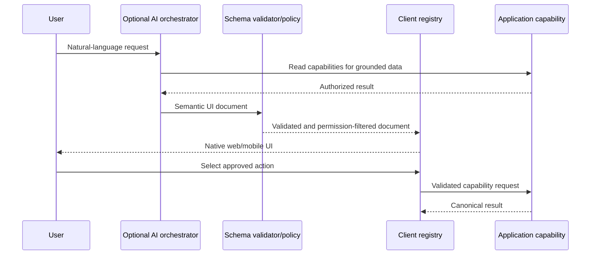

# Controlled generative UI

## Decision

AI may choose from a versioned semantic UI schema and approved component/action registry. It must
not generate arbitrary React, React Native, JavaScript, styles, URLs, SQL, or capability arguments
that bypass validation. Traditional authored screens remain the default and coexist with generated
surfaces.

The schema also must not name presentation libraries or their props. Values such as `shadcn.card`,
`base-ui.dialog`, `tailwindClassName`, and `gluestack.box` are invalid schema concepts. A semantic
WhereHouse component is the portability boundary:

```text
Generative UI schema -> WhereHouse semantic component -> platform registry
                                                    |-> web: shadcn / Base UI / Tailwind
                                                    `-> mobile: React Native / selected native foundation
```

## Example semantic document

```json
{
  "schemaVersion": "1.0",
  "surface": { "type": "search-results", "title": "HDMI cables" },
  "children": [
    {
      "type": "item-card",
      "version": 1,
      "props": { "itemId": "018f...", "showPhoto": true },
      "actions": [{ "id": "locate", "capability": "LocateItem", "input": { "itemId": "018f..." } }]
    },
    {
      "type": "breadcrumb-path",
      "version": 1,
      "props": { "locationIds": ["018a...", "018b..."] }
    }
  ]
}
```

The schema references IDs and display intent; clients retrieve authorized canonical data rather than
trusting model-authored labels for consequential information.

## Registry and rendering

`packages/ui-schema` should eventually contain discriminated TypeScript types, JSON Schema,
component/action definitions, fixtures, compatibility rules, and validation. It should not depend on
React. Each client owns a registry mapping semantic types to native components:

| Semantic type | Web rendering | Mobile rendering |
| --- | --- | --- |
| `item-card` | Dense card with hover/keyboard actions | Touch card with photo-first layout |
| `inventory-table` | Sortable accessible table | List or grouped cards |
| `spatial-view` | Embedded 3D view or fallback | Native 3D/AR launch or fallback |
| `add-item-form` | Desktop form | Step-based mobile form |

Initial approved concepts may include ItemCard, LocationCard, ContainerCard, SearchResults,
InventoryTable, PhotoGallery, ActionButton, ConfirmationCard, BreadcrumbPath, AddItemForm,
MoveItemForm, EmptyState, SpatialView, LocationExplorer, StorageRecommendation, ItemLocator,
InventorySummary, and FilterGroup. Registration requires a schema, permission requirements,
fallback, accessibility behavior, supported clients, and tests; it is not automatic.

Registry entries own platform-specific composition and may differ substantially between web and
mobile. They must provide an accessible authored fallback, including logical tree/list navigation
for a spatial surface. Unknown or unavailable entries degrade to their declared fallback and then a
generic unsupported-component card; the producer cannot substitute an unregistered primitive.

## Actions

Actions name an approved application capability or a safe client navigation command. The dispatcher:

1. Parses and validates the whole document against supported schema versions.
2. Removes/replaces components or actions not supported by the client.
3. Resolves current identity and capability permissions locally/server-side.
4. Revalidates action input in the application layer.
5. Shows confirmation for destructive, privacy-sensitive, or consequential writes.
6. Invokes the normal API/capability and renders canonical results.

The model cannot select arbitrary endpoints, methods, deep links, component imports, or external
URLs. Confirmation tokens are short-lived and bound to actor, capability, and exact arguments.

## Security and failure behavior

- Enforce maximum tree depth, child count, text length, payload size, and render time.
- Escape all text and disallow raw HTML/scripts/styles.
- Components declare required data and permissions; sensitive fields are filtered before the model
  sees them and before rendering.
- Unknown component: render its declared fallback, then a generic unsupported card; never crash the
  surface or silently execute its actions.
- Unsupported schema major version: reject the document and fall back to a traditional search/detail
  screen or plain-language response.
- Offline: render locally supported components from cached canonical data and disable unavailable
  actions with an explanation.
- Log schema/action IDs and outcomes for diagnostics, not unnecessary inventory contents/prompts.

## Generation flow



The AI service is optional: deterministic server/client code can produce the same schema for saved
views, QR scans, or rules. This makes the renderer independently testable and useful without AI.

## Versioning and rollout

Use semantic major/minor schema versions, integer component versions, additive optional properties,
and capability negotiation from clients. Producers target the lowest mutually supported version.
Keep fixtures for current and previous supported versions. Roll out one read-only surface first;
mutating forms wait until confirmation, permissions, audit, and offline behavior are established.
