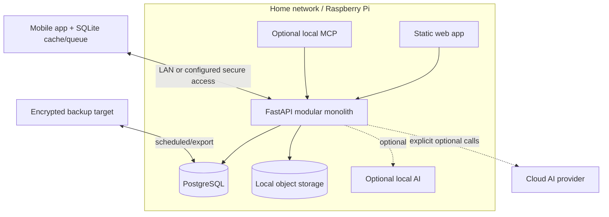

# Local-first architecture guidance

## Non-negotiable behavior

Core inventory creation, lookup, location management, QR resolution, and cached mobile workflows
must continue without cloud AI or a public internet connection. The canonical self-hosted deployment
is a modular monolith suitable for a Raspberry Pi-class device: web assets, FastAPI, PostgreSQL,
object storage, and later an optional local MCP adapter.

The diagram is conceptual: an in-process MCP adapter should call application capabilities directly
rather than loop through HTTP. The API remains the server authority; SQLite is the companion cache
and pending-operation store.

## Capability placement

| Capability | Fully local baseline | Optional enhancement |
| --- | --- | --- |
| Inventory/location CRUD and search | Required | Cloud hosting/remote access |
| QR identification and labels | Required | None required |
| Mobile cache and queued writes | Required | Future cross-instance sync |
| Photos | Local filesystem/object store | S3-compatible storage |
| MCP read/write | Future local server | Authenticated remote MCP |
| Natural-language interaction | Deterministic UI; optional local model | Cloud model |
| Image recognition/recommendations | Manual workflow always available | Local or cloud vision/AI |
| Spatial viewing | Local model assets when built | Cloud processing/CDN |

Provider interfaces must have explicit timeouts and failure modes; cloud failure returns to the core
workflow rather than blocking it. Never upload photos, scans, inventory, or prompts without an owner-
visible configured provider and data boundary.

## Offline and future sync

The mobile app currently caches canonical server data and queues limited writes. Queued item drafts
carry a schema version, and their stable local IDs make server-side item creation idempotent across
retries. Expand this into a versioned operation envelope containing actor/device, household, base
entity revision, timestamp, capability name, and validated payload as more writes are queued. Server
results are canonical. Do not silently use last-write-wins for item moves: surface conflicts when two
actors changed physical location.

Realtime WebSockets are invalidation hints, not replication or durability. Reconnect always fetches
canonical state. The current in-process hub suits one API process; multi-process deployment can add
PostgreSQL `LISTEN/NOTIFY` before introducing Redis. Future multi-server/cloud sync is a separate
replication product decision and is not implied by mobile offline queues.

## Pairing and secure remote access

Keep short-lived owner-approved pairing and device-scoped revocable credentials. Secrets live in
secure device storage, never SQLite. Local services bind conservatively; MCP binds to loopback by
default. Remote access requires owner setup, TLS, authentication, rate limits, revocation, backups,
and a documented threat model. Discovery must not publish household inventory metadata.

## Backup and restore

Before core data volume grows, provide a versioned backup manifest covering PostgreSQL, object files,
configuration needed for restore, and application/schema versions. Support encrypted, test-restored
exports to owner-controlled media/targets. A backup is incomplete if images or spatial model blobs
are omitted. Credentials and environment secrets require a separate documented recovery path; do not
silently export active bearer tokens.

## Pi constraints

- Prefer one API process and database; avoid microservices and always-on brokers.
- Bound image/scan processing and run heavy optional jobs asynchronously with resource limits.
- Keep ARM64-compatible dependencies and container images.
- Allow SSD-backed database/object storage and graceful degradation under low memory.
- Ship migrations and rollback/restore guidance; never require cloud control planes.
- Measure before adding caches, vector databases, or local models.

Local-first is an ownership and resilience property, not merely local hosting. Users must be able to
operate, export, back up, and recover their core data without a vendor service.
