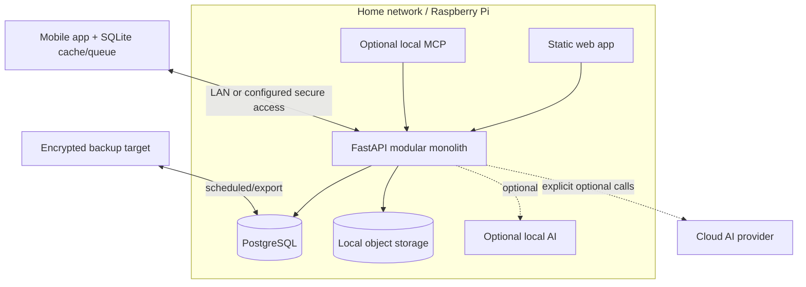

# Local-first architecture guidance

## Non-negotiable behavior

Core inventory creation, lookup, location management, QR resolution, and cached mobile workflows
must continue without cloud AI or a public internet connection. The canonical self-hosted deployment
is a modular monolith suitable for a Raspberry Pi-class device: web assets, FastAPI, PostgreSQL,
object storage, and later an optional local MCP adapter.

The diagram is conceptual: an in-process MCP adapter should call application capabilities directly
rather than loop through HTTP. The API remains the server authority; SQLite is the companion cache
and pending-operation store.

## Capability placement

| Capability | Fully local baseline | Optional enhancement |
| --- | --- | --- |
| Inventory/location CRUD and search | Required | Cloud hosting/remote access |
| QR identification and labels | Required | None required |
| Mobile cache and queued writes | Required | Future cross-instance sync |
| Photos | Local filesystem/object store | S3-compatible storage |
| MCP read/write | Future local server | Authenticated remote MCP |
| Natural-language interaction | Deterministic UI; optional local model | Cloud model |
| Image recognition/recommendations | Manual workflow always available | Local or cloud vision/AI |
| Spatial viewing | Local model assets when built | Cloud processing/CDN |

Provider interfaces must have explicit timeouts and failure modes; cloud failure returns to the core
workflow rather than blocking it. Never upload photos, scans, inventory, or prompts without an owner-
visible configured provider and data boundary.

## Offline and future sync

The supported MVP offline mutation set is deliberately one operation: `item.create` version 1. Its
SQLite envelope contains a stable operation ID, operation type/version, household, versioned payload,
creation time, replay status, attempt count, retry time, error, and eventual remote item ID. The ID is
created with the local draft, survives restart, and is reused as `client_operation_id` on every replay.
The backend's household-scoped uniqueness constraint and payload hash make the same ID and payload an
equivalent success and reject reuse with different data.

Queue insertion, the optimistic item/location cache rows, and recent-location update share one SQLite
transaction. Startup recovers `in_progress` work as retryable. Replay is sequential in creation order;
network/timeouts, 408/425/429, and 5xx use bounded exponential backoff, authentication/authorization
pauses replay without deleting work, and other 4xx responses remain visible as needing attention.
After success the client records the canonical ID before optional image upload, removes the operation
and temporary cache rows atomically, then refetches canonical state. A timeout after server creation is
safe because replay uses the same operation ID. Pending rows are explicitly household-scoped and are
never replayed under the selected household of another queue.

Device revocation stops replay and marks all still-pending operations on that installation as
needing attention. The rows and optimistic local data are retained, but a later re-pair does not
automatically replay them under a new credential. This is the simplest safe MVP policy until a
user-confirmed, provenance-aware queue migration capability exists.

Item edit, quantity change, movement, archive, identifier changes, location/container writes, and
standalone image mutation are intentionally online-only for MVP. The mobile UI reports their request
failure and does not claim that they were saved for later. This avoids silent last-write-wins behavior
until resource preconditions and capability-level idempotency exist. A creation draft may retain a
local photo; creation is idempotent and the image upload overwrites the deterministic item object key.
Updates left in the former pre-hardening queue are retained as needs-attention records rather than
being replayed with the old unsafe last-write-wins behavior or silently deleted.

Realtime WebSockets are invalidation hints, not replication or durability. Reconnect always fetches
canonical state. The current in-process hub suits one API process; multi-process deployment can add
PostgreSQL `LISTEN/NOTIFY` before introducing Redis. Future multi-server/cloud sync is a separate
replication product decision and is not implied by mobile offline queues.

## Pairing and secure remote access

Keep short-lived owner-approved pairing and device-scoped revocable credentials. Secrets live in
secure device storage, never SQLite. Local services bind conservatively; MCP binds to loopback by
default. Remote access requires owner setup, TLS, authentication, rate limits, revocation, backups,
and a documented threat model. Discovery must not publish household inventory metadata.

## Backup and restore

The implemented format provides a versioned manifest covering PostgreSQL, canonical image objects,
application/schema versions, exclusions, and SHA-256 integrity metadata. Local/external-volume and
Dropbox destinations receive the same completed artifact. Encryption remains unsupported in format
version 1 and must be a provider-neutral envelope when implemented. A backup is incomplete if
canonical images or future spatial blobs are omitted without policy. Credentials and environment
secrets use a separate recovery path; active bearer tokens are not exported.

## Pi constraints

- Prefer one API process and database; avoid microservices and always-on brokers.
- Bound image/scan processing and run heavy optional jobs asynchronously with resource limits.
- Keep ARM64-compatible dependencies and container images.
- Allow SSD-backed database/object storage and graceful degradation under low memory.
- Ship migrations and rollback/restore guidance; never require cloud control planes.
- Measure before adding caches, vector databases, or local models.

Local-first is an ownership and resilience property, not merely local hosting. Users must be able to
operate, export, back up, and recover their core data without a vendor service.
