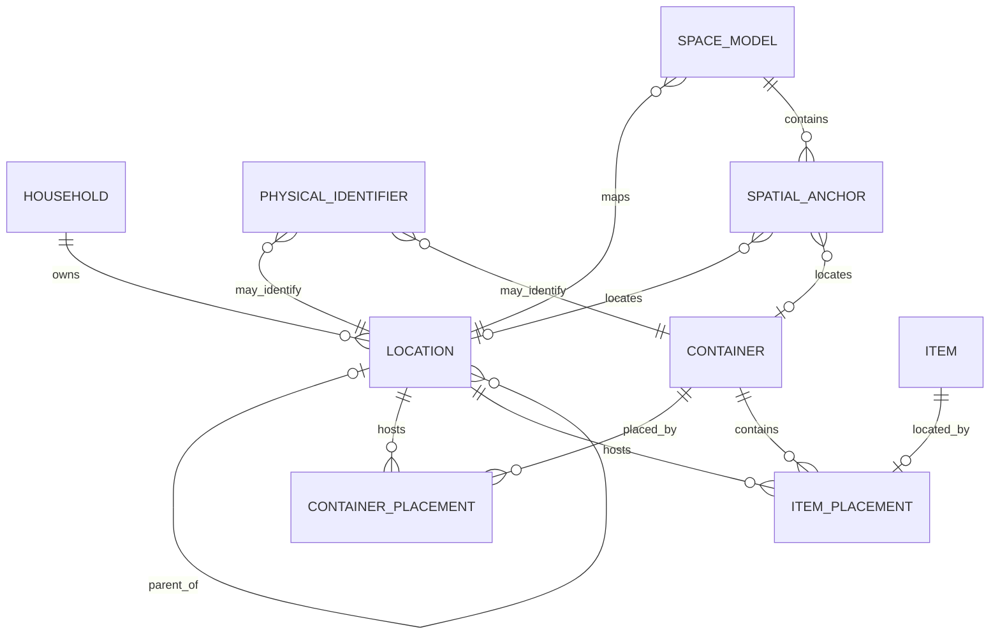
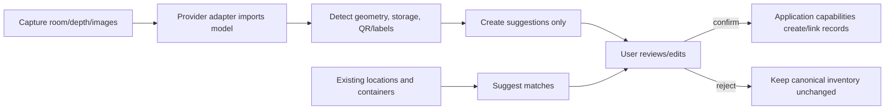

# Spatial model and digital twins

## Principles

The logical answer “Garage → West Wall → Shelf 3 → Red Bin” is useful without a scan. Spatial data
augments that answer; it never becomes required for creating, moving, or finding inventory. The
logical model uses stable WhereHouse IDs and remains independent of RoomPlan, ARKit, Android depth
APIs, and any geometry/rendering format.

## Conceptual model

This is a target vocabulary, not the current database schema:

- **Location**: stable logical node with optional parent and open-ended type (`property`, `building`,
  `room`, `zone`, `wall`, `shelf`, `other`, etc.). The tree has no fixed depth.
- **Container**: a physical, optionally movable holder/support. It may be placed at a location or in/on
  another container. A shelf may be modeled as a location when it is a durable part of a space, or a
  container when it is a tracked movable asset; the product must establish clear creation guidance.
- **SpaceModel**: a versioned scan/derived representation for a location, with provider-neutral
  metadata and references to geometry blobs.
- **SpatialAnchor**: a pose/bounds within a particular model revision, linked optionally to a logical
  location or container with confidence and provenance.
- **PhysicalIdentifier**: typed QR/NFC/visual-label value resolving to one target without making the
  target dependent on the identifier technology.

Current `Area`, `Zone`, `Container`, `ContainerPlacement`, and `ItemPlacement` remain valid for MVP.
A future migration should preserve their UUIDs or an explicit alias map. Do not add spatial fields to
every inventory row.

## Optional extensions

Dimensions, capacity, and transforms should be explicit value types with normalized units and a
declared coordinate frame. Suggested records include:

- `PhysicalDimensions(target_type, target_id, width, height, depth, unit, measured_at, source)`
- `Capacity(target_id, volume, max_weight, units, source)`
- `SpaceModel(id, location_id, format_version, provider, coordinate_system, geometry_key, revision)`
- `SpatialAnchor(id, model_id, target_type, target_id, transform, bounds, confidence, status)`

Queryable, stable concepts belong in columns/tables. Provider payloads and infrequently queried scan
metadata may be retained as versioned JSON/blob artifacts. Geometry belongs in object storage, not
normal relational rows. A transform is meaningful only with its model revision and coordinate frame.

## Scan and confirmation workflow

Computer vision may suggest walls, shelves, cabinets, bins, doors, tools, or labels. Suggestions have
confidence and provenance and cannot silently create, move, merge, or delete canonical inventory.
Repeat scans create revisions; they do not overwrite the only copy of an earlier model.

## QR and physical identity

A public code such as `WH-BIN-0182` resolves through an identifier service to a stable WhereHouse
target. Scans and anchors reference that same target ID. Reprinting or rotating a code changes the
identifier record, not the location/container identity. Identifier values are unique per namespace,
revocable, auditable, and safe to expose; internal UUIDs need not be printed.

A QR scan can open a traditional detail screen, a generative semantic card, an MCP resource, or an
AR target through a capability/deep-link action. QR itself grants no authorization.

## 3D visualization

Web and mobile render a provider-neutral view model derived from `SpaceModel` plus anchors and
inventory summaries. Web may use Three.js/WebGL/WebGPU; mobile may use a native or React Native-
compatible renderer. Technology selection waits for prototypes covering bundle/device support,
performance, offline asset storage, accessibility, and Pi-hosted delivery.

The viewer requests capabilities such as `GetSpatialMap` and `GetLocationContents`; selection emits
stable IDs. It may highlight search results, occupancy, or available areas without owning inventory
rules. Logical tree navigation remains available and accessible when 3D is unsupported.

`SpatialView` is also the semantic UI boundary. A generative UI document may request a supported
`spatial-view` with stable WhereHouse IDs and display intent, but cannot select Three.js, React Three
Fiber, ARKit, or another renderer. The web and mobile registries choose their platform adapter and
fall back to accessible logical location content when spatial rendering is unsupported.

## AR item finding prerequisites

AR guidance is feasible only after:

1. A stable logical destination and item/container placement exist.
2. A current model revision has a confirmed anchor for that destination.
3. The device can localize into the same coordinate frame.
4. Confidence and staleness exceed product-defined thresholds.
5. Anchor invalidation/relocalization and moved-container workflows exist.

The response should degrade from precise overlay → approximate zone guidance → logical breadcrumb.
Never present a low-confidence anchor as exact. Moving a shelf/container or replacing a scan marks
dependent anchors stale until reconfirmed.

## Spatial storage intelligence

Fit and capacity recommendations are future application capabilities. They combine normalized
dimensions, containment, weight limits, measured/estimated occupancy, accessibility, category
preferences, and confidence. Results are recommendations with assumptions—not automatic moves.
Unknown dimensions remain unknown; “fits” must not be inferred from missing data. Start with manual
dimensions and simple bounding-box checks before computer vision or packing optimization.

## Technology evaluation, not selection

- Apple RoomPlan/LiDAR/ARKit: likely strong capture/localization on supported Apple hardware.
- Android depth/spatial APIs: evaluate device coverage and persistence guarantees.
- Three.js and WebGL/WebGPU: evaluate web delivery, large-model performance, and fallback behavior.
- React Native 3D/AR options: evaluate native maintenance burden and Expo compatibility.

Provider adapters import/export a WhereHouse spatial contract. No provider identifier should become
the primary key of a logical entity.
